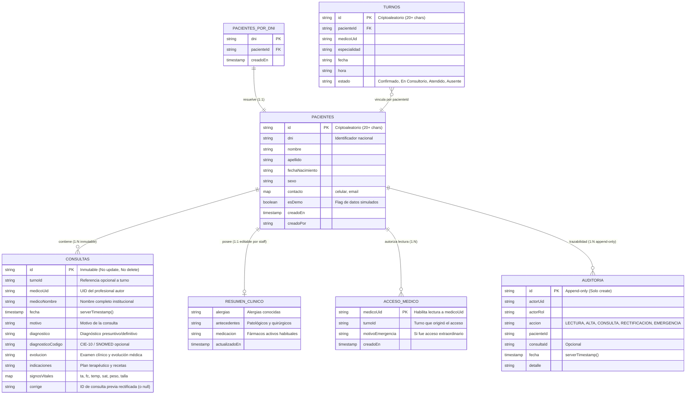

# Arquitectura de Historia Clínica Electrónica y Seguridad (Ley 26.529)

Sistema de Historia Clínica Electrónica (HCE) del **Hospital Teodoro J. Schestakow**, diseñado bajo principios de inmutabilidad, confidencialidad, trazabilidad y mínimo privilegio, adaptado para operar en el nivel gratuito de **Firebase Spark** en el marco del foro tecnológico y académico de ingeniería e innovación.

---

## 1. Diagrama de Arquitectura y Relación de Entidades



---

## 2. Matriz de Control de Acceso Basada en Roles (RBAC)

| Entidad / Colección | Paciente (Público) | Recepción | Médico Asignado | Médico No Asignado | Administración (Auditoría) |
|---|---|---|---|---|---|
| `turnos` | Solo `getDoc` de su propio ID cripto | Lectura y actualización de estado | Lectura de turnos de su agenda | Denegado | Lectura y gestión general |
| `disponibilidad` | Lectura de catálogo; Creación atómica sin colisión | Lectura y gestión | Denegado | Denegado | Gestión de slots |
| `pacientes_por_dni` | Denegado | Lectura y creación | Lectura y creación | Lectura y creación | Lectura |
| `pacientes/{id}` (Demografía) | Denegado | Lectura y creación inicial | Lectura y actualización básica | Denegado (salvo Emergencia) | Lectura |
| `pacientes/{id}/clinico/resumen` | Denegado | Denegado | Lectura y actualización | Denegado (salvo Emergencia) | Lectura |
| `pacientes/{id}/consultas/{id}` | Denegado | Denegado | **Create (inmutable)** y Lectura | Denegado (salvo Emergencia) | Lectura histórica |
| `pacientes/{id}/acceso/{uid}` | Denegado | Denegado | Lectura de su documento (`uid`) | Create (acceso de emergencia) | Lectura |
| `auditoria/{id}` | Denegado | Create (logs de turno) | Create (logs clínicos) | Create (log de emergencia) | Lectura de auditoría |

---

## 3. Principio de Inmutabilidad y Flujo de Rectificación (Ley 26.529)

La legislación argentina de Derechos del Paciente e Historia Clínica (Ley 26.529, modificada por Ley 26.742) y las buenas prácticas internacionales exigen:
1. **Intangibilidad del registro clínico**: Ningún dato médico asentado puede ser alterado, sobrescrito ni destruido retroactivamente.
2. **Corrección mediante adenda firmada**: Cualquier enmienda o aclaración debe constar como una nueva entrada con fecha, hora e identificación del profesional actuante, haciendo referencia al registro previo que se aclara o rectifica.

### Enfoque Técnico en Firestore:
```javascript
// firestore.rules
match /pacientes/{pacienteId}/consultas/{consultaId} {
    // Permite lectura únicamente si el profesional posee acceso otorgado
    allow read: if esStaffAutenticado() && (
        tieneRol('Administración') ||
        exists(/databases/$(database)/documents/pacientes/$(pacienteId)/acceso/$(request.auth.uid))
    );

    // Permite creación validando que sea el médico autenticado
    allow create: if esStaffAutenticado() &&
        tieneRol('Médico') &&
        request.resource.data.medicoUid == request.auth.uid;

    // INMUTABILIDAD ESTRICTA: Queda terminantemente prohibida la edición o eliminación
    allow update: if false;
    allow delete: if false;
}
```

Cuando un médico detecta una errata o cambio clínico, la interfaz dispara `guardarRectificacionInmutable()`:
1. Genera un nuevo documento en `consultas/{nuevaId}`.
2. Establece `corrige: consultaOriginalId`.
3. El documento original **permanece intacto**.
4. La cronología resalta visualmente ambas entradas (consulta previa advertida y nueva adenda de rectificación).

---

## 4. Mecanismo de Acceso de Emergencia ("Romper el Vidrio")

En situaciones críticas de guardia o urgencias médicas, un paciente puede requerir atención inmediata sin un turno asignado previamente en agenda.

### Protocolo de Seguridad:
1. El médico pulsa **"Acceso Emergencia"** e ingresa el DNI del paciente y un motivo justificado (mínimo 10 caracteres).
2. Se ejecuta una transacción atómica `writeBatch`:
   - Crea o localiza la ficha del paciente.
   - Crea el pase de acceso en `pacientes/{pacienteId}/acceso/{medicoUid}` con `motivoEmergencia`.
   - Escribe un registro inmutable en `auditoria/{id}` con acción `ACCESO_EMERGENCIA`.
3. El motor de reglas de Firestore valida la existencia del documento de acceso y permite la apertura inmediata de la historia clínica.
4. El log de auditoría no puede ser borrado por ningún usuario, asegurando rendición de cuentas posterior.

---

## 5. Arquitectura Spark (Free Plan) y Mitigaciones en el Cliente

Al operar en el plan gratuito **Firebase Spark** (sin Cloud Functions ni backend Node dedicado):
1. **Atomicidad por Lote (`writeBatch`)**: El cliente ejecuta en una sola petición indivisible la creación del índice de DNI, la ficha demográfica, el acceso y la auditoría. Si cualquiera falla, nada se persiste.
2. **Defensa en Profundidad en Reglas**: Las reglas de Firestore no confían en el cliente; validan que `request.auth.uid` coincida, que los campos requeridos existan y que las consultas no puedan mutar.
3. **Cierre de Sesión Automático**: Temporizador de 15 minutos de inactividad en el cliente para prevenir acceso no autorizado en terminales médicas compartidas.
